# Overview

Experiments about truth value formula calculation for the conjunction
introduction rule.

## Towards Correct Calculations of Confidences

In this section we attempt to improve the confidence calculations in
PLN inference rule formulas.  The goal is to get calculations which
are efficient yet justified by probability theory.  It is our belief
that the ideal calculations can only be obtained via uncomputable
integration over multiple worlds (and to that end we intend to
eventually introduce a Universal Truth Value, or UTV for short).  In
this work we suggest localized and efficient forms of such
integration, that we hope can later be formally justified as
approximations of such universal integration.

We start with the conjunction introduction rule for its simplicity.
All the code involved in these experiments can be found in
[conjunction-xp.mac](conjunction-xp.mac).

### First Attempt Uniformly Sampling Underlying Sets

A question that has been in the back my mind for a while is:

What is the probability distribution obtained from applying a rule
formula to premises which are themselves first order probabilities?

Let us for instance consider the conjunction introduction rule

```
A ≞ TVA
B ≞ TVB
⊢
(A ∧ B) ≞ TVAB
```

In order to obtain an accurate estimate of `TVAB` one would ideally
1. sample `TVA` and `TVB` to obtain first order probabilities, say
   `pA` and `pB` for a sample size of 1,
2. multiply `pA` and `pB` to obtain `pAB`, i.e. `pAB = pA*pB`,
3. repeat to 1 to get enough a large sample of `pAB` and fit whatever
   underlying distribution we choose to represent `TVAB` (like a beta
   distribution, as unfit as it may generally be).

The question in step 2 is: should we casually multiple `pA` with `pB`
to obtain `pAB`?  Meaning should we assume that `pA` and `pB` are
independent?  Or do we need to worry about the fact that we don't know
if `pA` and `pB` are independent and therefore we should instead
integrate over all possible ways that `A` and `B` could be
distributed?  Indeed, `A` and `B` could have true probabilities `pA`
and `pB` respectively, yet perfectly overlap i.e. `pAB = min(pA, pB)`,
or not overlap at all, that is `pAB = 0`, etc.  If we integrate over
all possible ways that `A` and `B` could be distributed, maybe we get
a variance that we need to account for so that instead of obtaining
`pAB = pA*pB` we obtain a distribution over `pAB`?  If this is the
case then the concluding TV `TVAB` would take into account the
variances of these "distrolets" obtained during step 2.

Given these specific premises the answer to this question is no, we do
not need to worry about integrating over all possible ways that `A`
and `B` could be distributed.  We merely can assume that they are
independent because the distrolet obtained from such integration when
the size of the universe tends to infinity tends to a Dirac delta
distribution with mean `pA*pB`.  In order words, considering all
possible ways that `A` and `B` could be distributed without any
additional knowledge about them other than the fact that they are
uniformly randomly distributed is equivalent to assuming that they are
independent!  I know it sounds obvious when phrased in that way, but
keep in mind that this is only true when the size of the universe is
infinit.

To reach this conclusion we have conducted the following experiment
using Maxima.

We begin by defining how many ways `A` and `B` could intersect with
intersection `|A ∩ B| = k`.  For that we use combinations to obtain
the following

```
Pr(|A ∩ B| = k) = binomial(a, k) * binomial(n-a, b-k) / binomial(n, b)
```

where `|A|=a`, `|B|=b` and `|U|=n` (`U` is the universe).

Let us replace `k` by `n*x`, `a` by `n*pa` and `b` by `n*pb`, where
`pa` (resp. `pb`) is the marginal probability of `A` (resp. `B`).
Using the Stirling approximation of factorial we can derive that

```
Pr(pAB = x) = (sqrt(pa*pb*(1-pa)*(1-pb)) / (sqrt(2*%pi*n*(pa-x)*(pb-x)*x*(x-pb-pa+1))))
            * ((pa**pa * pb**pb * (1-pa)**(1-pa) * (1-pb)**(1-pb))
               /
               ((pa-x)**(pa-x) * (pb-x)**(pb-x) * x**x * (x-pb-pa+1)**(x-pb-pa+1)))**n
```

Or as rendered by Maxima

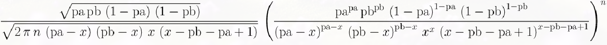

This allows us to calculate `Pr(pAB = x)` for very high values of n.

Let us start by plotting distrolets for `pA=pB=0.5` using combinations
varying `n` from 50 to 400.

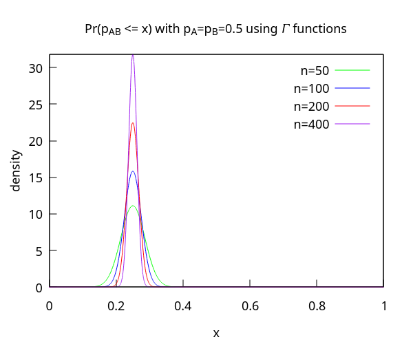

Already we can see a clear trend where the distrolet is shrinking as
`n` goes up.

Using Stirling approximation we can push `n` much larger and see that
the distrolet tends to a Dirac delta distribution.

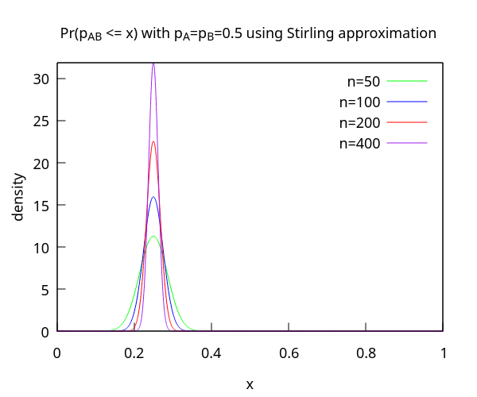
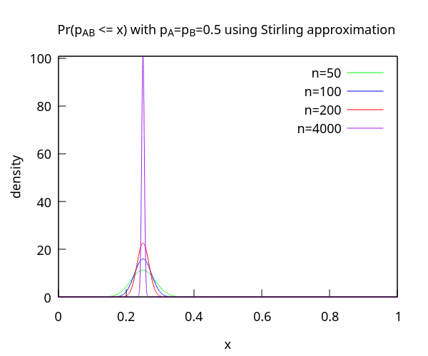
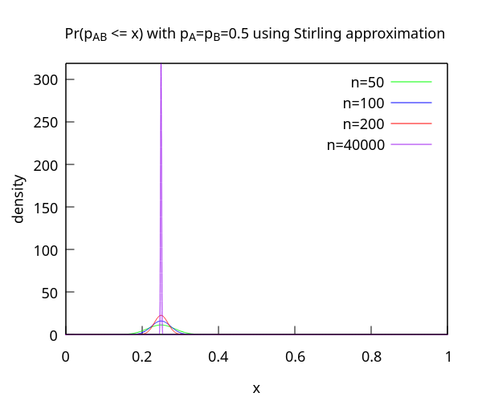
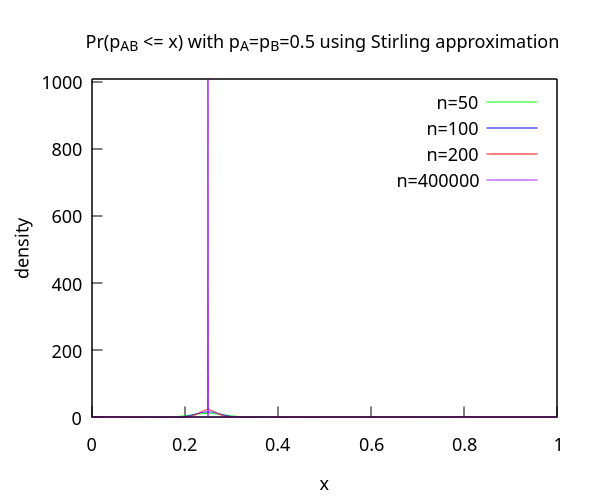
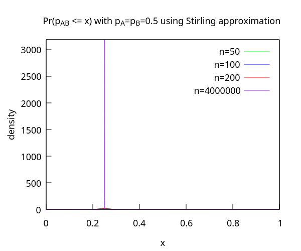

I know a rigorous proof would be better, but I think it is already
convincing enough that it converges to a Dirac delta distribution of
mean `pAB=pA*pB`.

### Second Attempt Introducing Extra Random Dependencies

Obviously the reason we obtain Dirac delta distributions is because A
and B are uniformly independently sampled, which is equivalent to
assuming that they are independent.  Indeed, as their sizes tend to
infinity all random fluctuations that may have introduce dependencies
vanish.

In this second attempt we introduce an extra premise that explicitly
states dependencies.  The conjunction introduction rule is thus
reformulated as

```
A ≞ TVa
B ≞ TVb
A → B ≞ TVab
⊢
A ∧ B ≞ TVAB
```

This formulation generalizes the one in the section above, which can
be recovered by setting `TVab = <1, 0>`, representing the absence of
knowledge about `A → B`.

If `TVab = <1, 0>`, the sampling process to estimate the second order
distribution associated to `TVAB` will still account for `A → B` but
consider a beta distribution prior, such as the Bayes' prior, to
sample from.

Like for the deduction rule, probability theory imposes some
constraints over what probabilities are possible.  Specifically, given
first order probabilities `pa` sampled from `TVa` and `pb` sampled
from `TVb`, probability `pab` sampled from `TVab` must be within the
following bounds

```
max(1+(pb-1)/pa, 0) <= pab <= min(1, pb/pa)
```

assuming that `0 < pa`, otherwise `pAB = 0` anyway.

This inequality is justified by considering the extremes within which
`Pr(A,B)` must be bound, corresponding to two situtations

1. `A` and `B` intersect the least, corresponding to `max(pa+pb-1, 0)`,
2. `A` and `B` intersect the most, corresponding to `min(pa, pb)`.

That is

```
max(pa+pb-1, 0) <= pAB <= min(pa, pb)
```

since

```
pab = Pr(A|B) = Pr(A,B)/Pr(B) = pAB/pa
```

the inequality of `pab` is obtained by dividing everything by `pa`.

Interestingly, given the localized nature introduced by these bounds,
we can resurrect the idea of replacing concluding first order
probabilities by distrolets.  Below is a plot showing such distrolets
for various values of `pa` and `pb`.

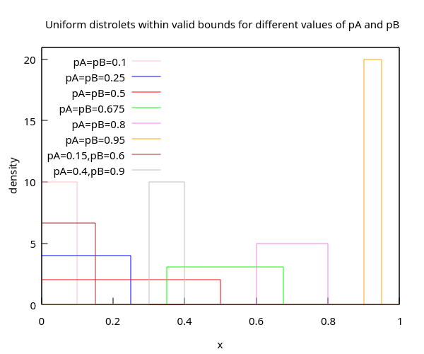

### Compare Conjunction Introduction with and without Dependencies

Let us now put all this together and build second order distributions
obtained from the sampling method described earlier, which, to sum up,
consists of sampling first order probabilities from premises, then
either apply the product or sample from distrolets to obtain first
order probability samples to build the concluding second order
distribution.

What we would like to see is how much variance in the concluding
distribution the distrolets bring vs using the independence
assumption.  To that end we produce for each pair of premises, ranging
from high to low confidence, three plots, one with independence
assumption (Dirac delta distrolet), a second derived from the extra
premise `A → B` with null confidence, i.e. a uniform distrolet with
the admissible range constrained by probability theory, a third
obtained from replacing the uniform distrolet by a bimodal
distribution with two Dirac deltas at its lower and upper admissible
extremities.  The later is hoped to emulate the most conservative
conjunction introduction, producing conclusions with the maximum
variance.

In all plots, the blue and green curves indicate the PDFs of the
premises, while the red histogram indicates the PDF of the conclusion.

We start with premises with high confidences (α=6000 and β=3000 for
the first premise, α=1000 and β=100 for the second premise).

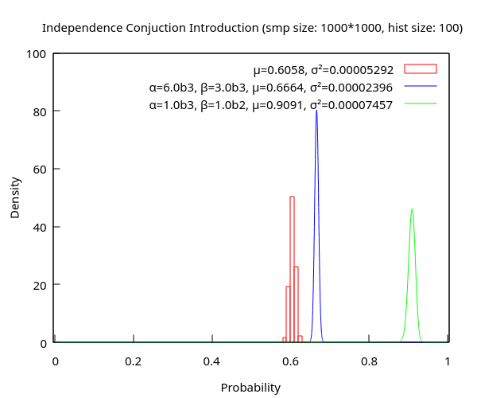
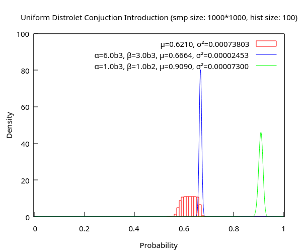
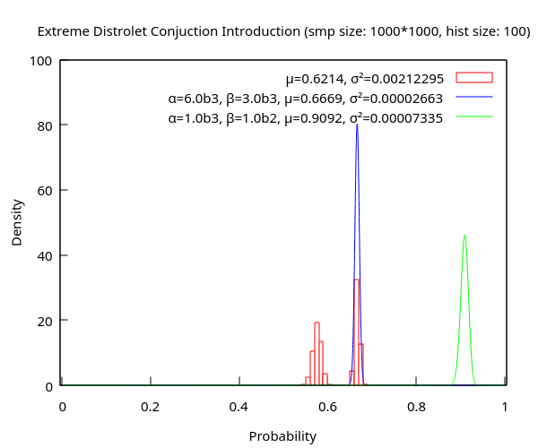

One can observe that for such high confidences the desired effect is
obtained, meaning that the variance of the conclusion using uniform
distrolets, 0.00073803, is substantially greater than that of both its
premises, 0.00002453 and 0.00007300.  It is also substantially greater
than the one obtained by making the independence assumption,
0.00005292.  The variance obtained from the extreme distrolets is even
greater, 0.00212295, but result in a bimodal distribution which is
probably not desirable.

We continue with similar premises but with reduced confidences (α=500
and β=300 for the first premise, α=100 and β=10 for the second
premise).

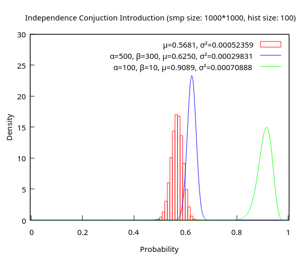
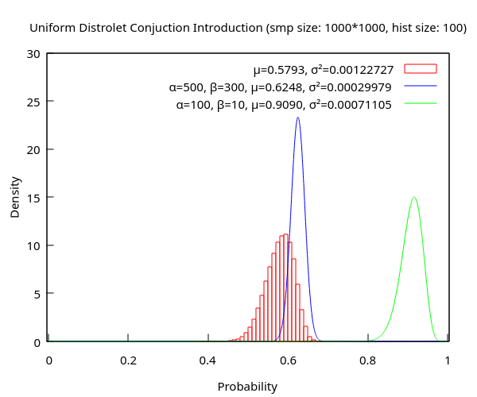
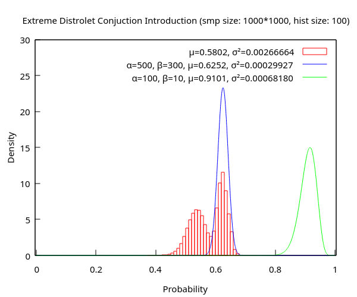

The same phenomenon, albeit less acute, can be observed, with
variances 0.00122727 for the uniform distrolets and 0.00266664 for the
extreme distrolets, greater than the variances of their premises.

In the following plots the confidence of the first premise is
substantially reduced (α=50 and β=30 for the first premise).

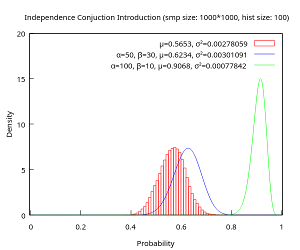
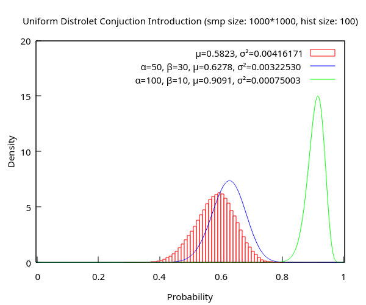
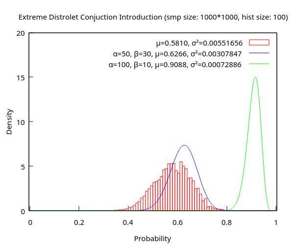

The same phenomenon is still observed albeit less acutely.

The next plots consider premises with 4 positive and 4 negative pieces
of evidence for both premises.

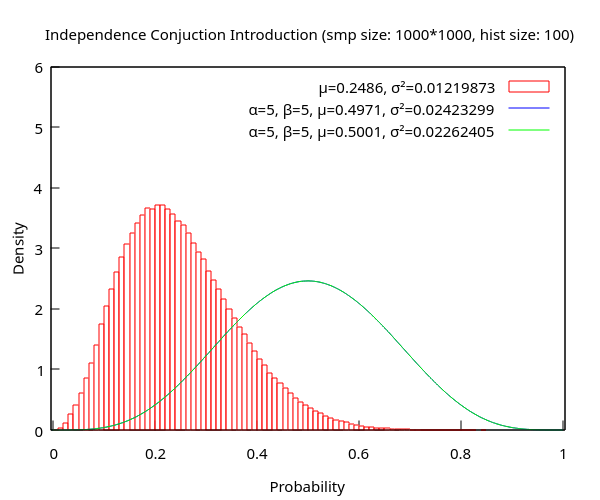

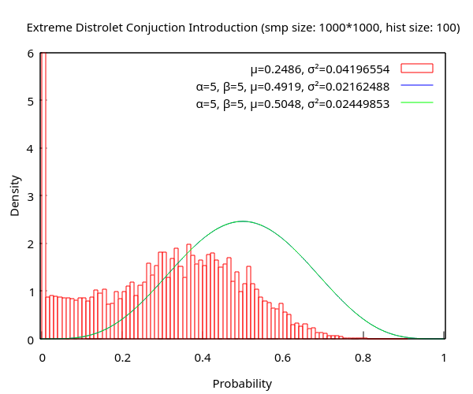

As before, using the uniform distrolet provides a larger variance, how
the resulting concluding distribution is now quite far from a beta
distribution as it has a bell like shape that, unlike with beta
distribution, is cut a third of the way left.  This would badly fit a
beta distribution, which is problematic if we wish to keep simple
truth values all the time.  This will have to be studied in the
future.

The next plots consider premises with only positive evidence and very
low confidences.

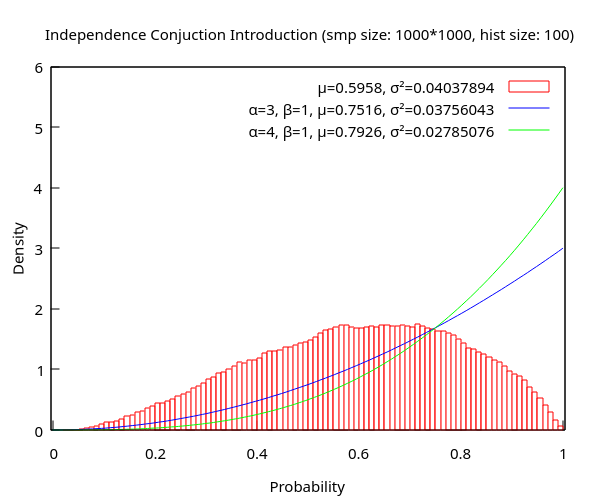

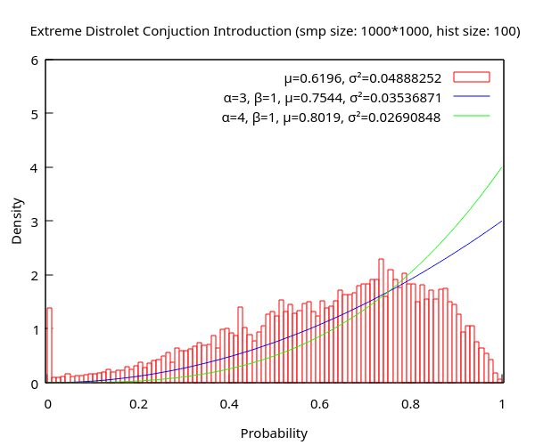

Interestingly here even the concluding variance obtained from the
independence assumption, 0.004037894, is greater than the variances of
its premises, 0.033756043 and 0.02785076.  In fact, the concluding
variances in all three cases are not far apart, with 0.04628453 for
the uniform distrolets and 0.04888252 for the extreme distrolets.  For
the latter, the extreme distrolets, one may notice a spike at 0.  This
is because when the first order sampled probabilities sum up to less
than one, zero is selected as concluding probability half of the time.

In the next plots, the premises have respectively one positive and one
negative evidence.

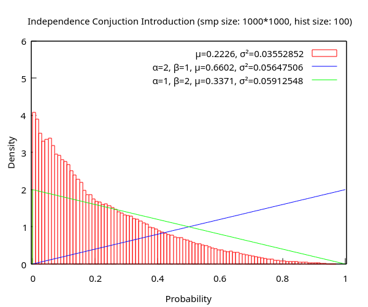

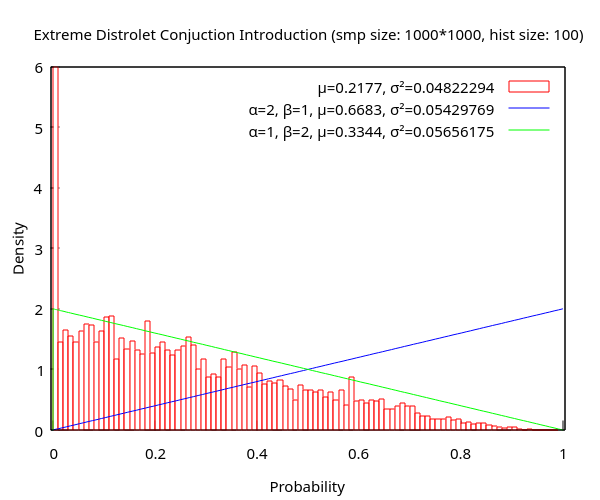

Contrary to the previous case, the concluding variances, 0.03552852
for the independence assumption, 0.03872038 for the uniform distrolets
and 0.04822294 for the extreme distrolets, are all below that of their
premises, which are approximately 0.05.  All concluding second order
distributions are shifted to the left.

These next plots show the concluding distributions when the premises
have null confidence.

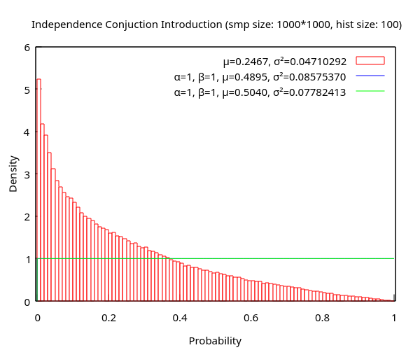

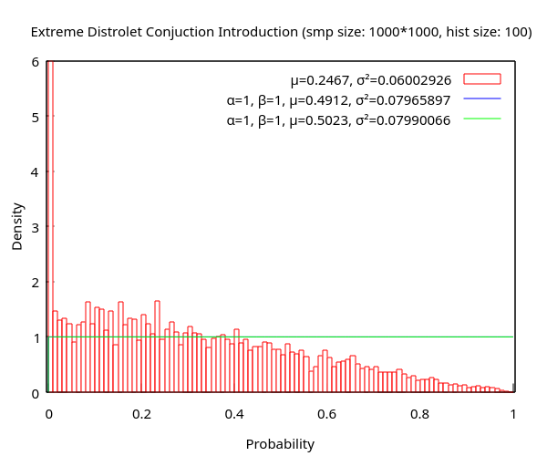

Like above, all concluding variances are less than the variances of
the premises, and all concluding second order distributions are
shifted to the left.  Clearly these second order distributions would
corresponds to simple truth values with a positive count of positive
and total evidence, while no observation has ever been made.

Let us push the experiment even further by considering other priors,
start with Jeffreys'.

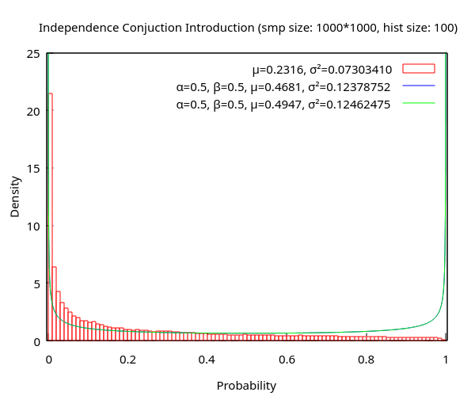

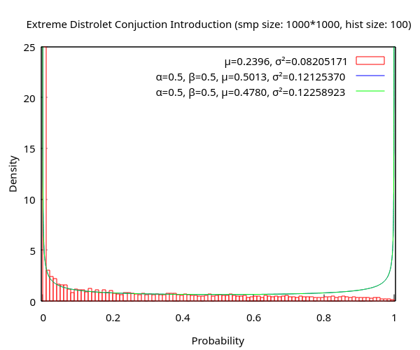

For all three cases (independence, uniform and extreme), the resulting
variances, around 0.07, are smaller than that the variances of the
premises, even more so than with a Bayes' prior.  Note that the
resulting mean, around 0.23, remains close to 0.25.  Overall the
results make sense.

Then let us consider a prior somewhere between Jeffreys and Haldane
with α=β=0.1.

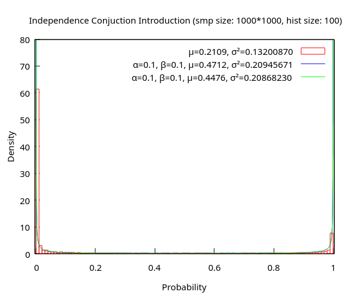

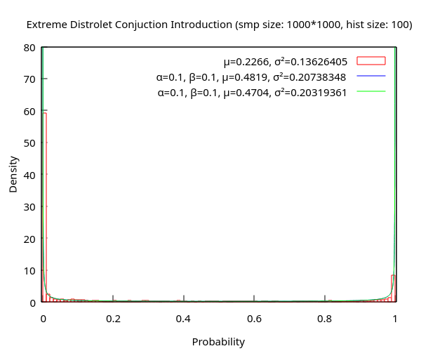

The resulting means, around 0.22, are drifting a bit away from 0.25.
One may notice that the means of premises are around 0.47 instead of
0.5, likely due to some floating point number calculation
imprecisions, so that might explain it.  But overall the results still
make sense.

Finally let us consider a prior that is getting even closer to the
Haldane prior with α=β=0.01.

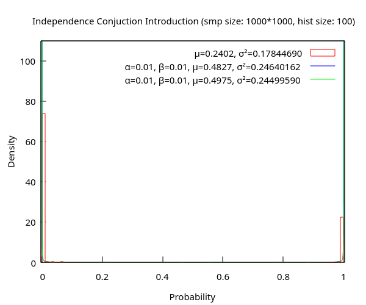

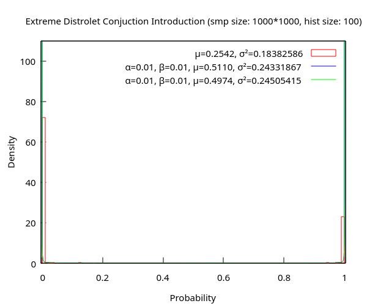

The concluding distributions, in all three cases, is now almost
completely equivalent to Bernoulli distributions, where the densities
are split between completely zero or completely one with means around
0.25.

To conclude, it interestingly seems that the structure of a composite
predicate, like a conjunction of two predicates, by itself provides
some forms of evidence.  In other words, evidence can be obtained not
just from direct observations but from structures as well.

### Express Dependencies with Equivalence instead of Implication

Let us explore a variation where the extra premise to capture
dependence is formulated using Equivalence rather that Implication (as
suggested in [Ben's document](PLN_AND_Confidence_Framework.md.pdf)).
In this case the inference rule for conjunction becomes

```
A ≞ TVa
B ≞ TVb
A↔B ≞ TVab
⊢
A∧B ≞ TVAB
```

The semantics of `A↔B` corresponds, in probabilistic terms, to

```
P(A∧B|A∨B)
```

Let us assume that the first order probabilities are sampled as
follows

```
pa ~ TVa
pb ~ TVb
pab ~ TVab
```

and let us examine the question of how to obtain `pAB=P(A∧B)`.

```
P(A∧B|A∨B) = P(A∧B) / P(A∨B)
P(A∧B|A∨B) = P(A∧B) / (P(A) + P(B) - P(A∧B))
pab = pAB / (pa + pb - pAB)
```

Let us express `pAB` w.r.t. to `pa`, `pb` and `pab`

```
pab = pAB / (pa + pb - pAB)
(pa + pb - pAB) * pab = pAB
pa*pab + pb*pab - pAB*pab = pAB
pa*pab + pb*pab = pAB + pAB*pab
pa*pab + pb*pab = pAB * (1 + pab)
pAB = (pa*pab + pb*pab) / (1 + pab)
```

The procedure to obtain `pAB` is therefore going to be

1. Sample `pa ~ TVa`
2. Sample `pb ~ TVb`
3. Sample `pab ~ TVab` (within valid bounds)
4. Calculate `pAB = (pa*pab + pb*pab) / (1 + pab)`

Let us assign a Bayes' prior over the second order distribution over
`TVab` when `A↔B` is completely unknown, that is a uniform second
order distribution.  We still need to sample `TVab` so that `pAB` is
within valid bounds.  To that end we attempt to derive the bounds of
`pab` given the bounds of `pAB` recalled below

```
max(pa+pb-1, 0) <= pAB <= min(pa, pb)
```

According to [DeepSeek](bound-proof-deepseek.org), we get

```
max(pa+pb-1, 0) <= pab <= min(pa/pb, pb/pa)
```

We did not go through its log to verify that its reasoning is correct.
Let us however plot `pAB` with respect to `pab` and vice versa for
various values of `pa` and `pb` while maintaining `pAB` and `pab`
within their supposedly valid bounds.

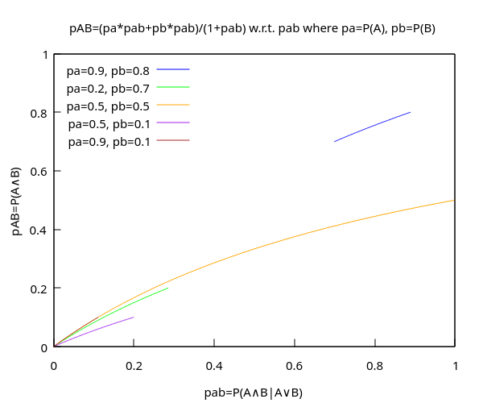
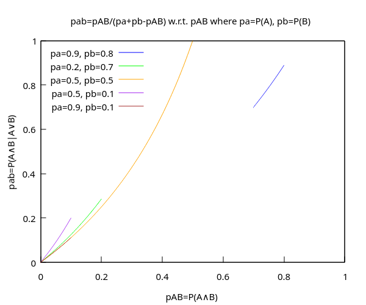

It is clear that the plots of `pAB` with respect to `pab` perfectly
mirror the plots of `pab` with respect to `pAB`, bounds included, thus
the lower and upper bounds of `pab` inferred by DeepSeek are likely
correct.

Note that since the function mapping `pab` to `pAB` is not linear,
building the second order distribution of `A∧B` via sampling `pab`
(then mapping `pab` to `pAB`) according to `A↔B` is going to yield
different results than sampling according to `A→B`.  Indeed, the
relationship between `A→B` and `A∧B` is linear while the relationship
between `A↔B` and `A∧B` is not.  To see how they differ let us plot
the distrolets associated to `A↔B` and `A∧B` for various first order
probabilities of `A` and `B`.

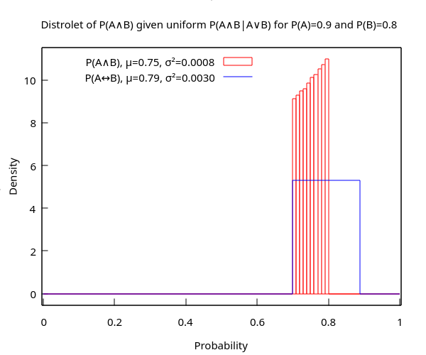
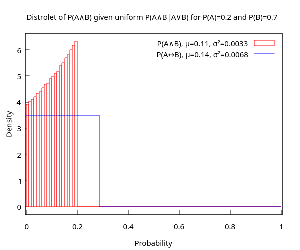
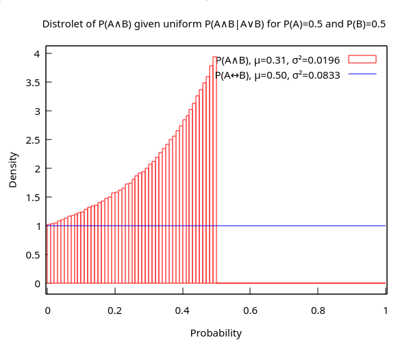
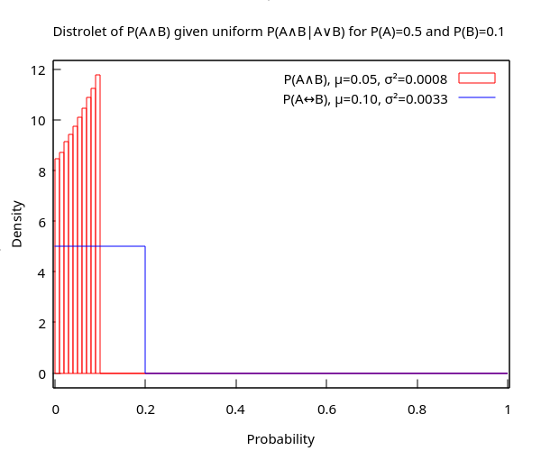
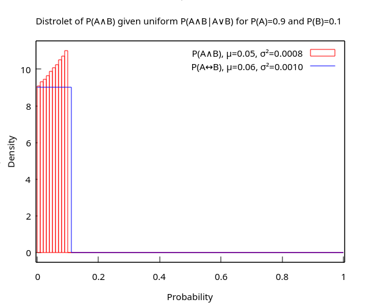

Across all plots, the distrolets associated to `A∧B`, in red, look
like they are quadratically increasing.  We anticipate that this will
have the effect of shifting the means of the concluding distributions
to the right.  Let us plot various concluding distributions for
difference simple truth values to examin that.  For better comparison
we also replot the concluding distribution obtained with `A→B` as
extra premise.


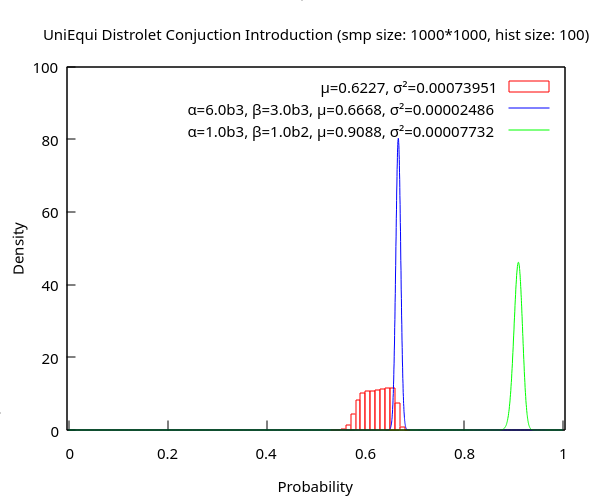

Already one can see a slight increase in the means, with 0.6210 when
using `A→B` and 0.6227 when using `A↔B`.  The resulting distribution
when using `A↔B` also retain the quadratic increase.  The variance of
the distribution obtain using `A↔B` is also a tiny bit greater,
0.00073951 with `A↔B` vs 0.00073803 with `A→B`.


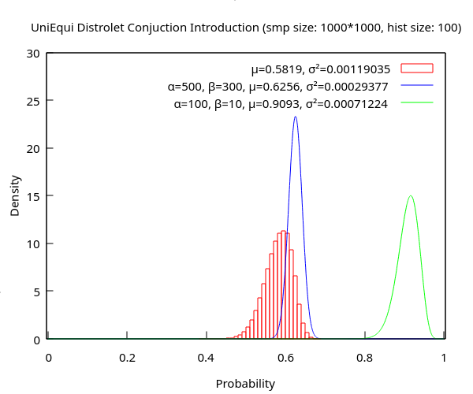

In these two plots above the concluding distributions look visually
identical but again the mean obtained with `A↔B`, 0.5819, is greater
than the mean obtained with `A→B`, 0.5793.  This could be however due
to the fact that the samples picked in the `A↔B` experiment for `A`
and `B` also have larger means, respectively 0.6256 and 0.9093 with
`A↔B` and respectively 0.6248 and 0.9090 with `A→B`.  The variances
however follow another trend, being greater with `A→B`, 0.00122727,
than with `A↔B`, 0.00119035.


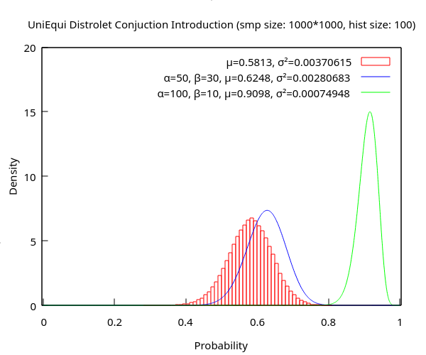

In the two plots above the mean obtained with `A↔B`, 0.5813, is
actually less than that obtained with `A→B`, 0.5813.  That could be
explained however by differences in means of the samples obtained from
the premises `A` and `B` as above.  It is unclear at this point.  The
variance obtained with `A↔B` is also less than the one obtained with
`A→B`.


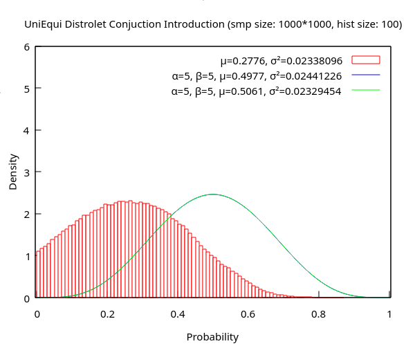

The plots above involve premises with lower counts, 4 positive and 4
negative counts each.  The difference in means is more significant,
being 0.2776 with `A↔B` and 0.2472 wth `A→B`.  The variance with
`A↔B`, 0.02338096, is also greater than the variance with `A→B`,
0.02266180, but could be from a difference of variances in the
premises.


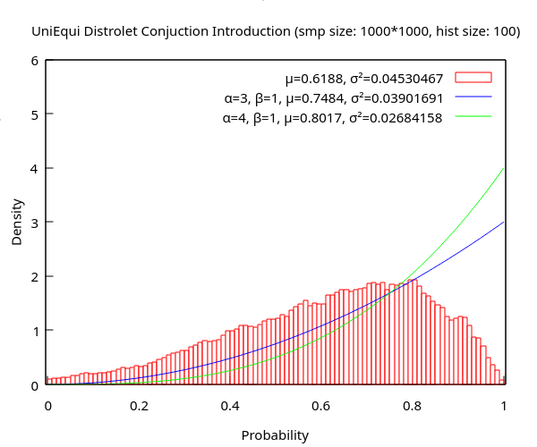

Once again the mean obtained with `A↔B` is greater than the one
obtained with `A→B`.  The variance obtained with `A↔B` is less than
the one obtained with `A→B`.


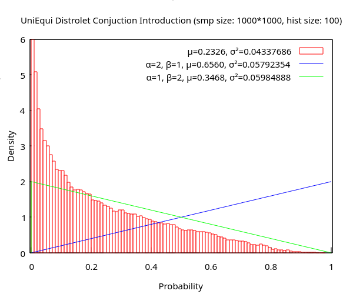

Once again we observe that the mean obtained with `A↔B` is greater
than the one obtained with `A→B`.  This time the variance obtained
with `A↔B` is greater than one obtained with `A→B`.


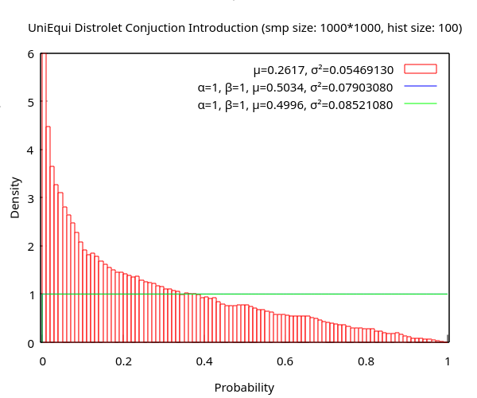

Same thing again, greater mean with `A↔B` than `A→B`.  The variance
obtained with `A↔B` is less than the variance obtained with `A→B`.  At
this point there seems a clear pattern for the mean but no pattern for
the variance.


Again, greater mean with `A↔B` than `A→B`.  The variance with `A↔B` is
greater than the variance with `A→B` this time.


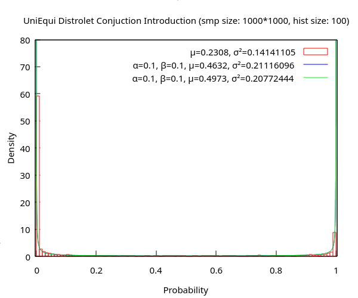

Finally, the mean with `A↔B` is greater than the one with `A→B` and
the variance with `A↔B` is also greater than the one with `A→B`.

Over the 9 pairs of plots above, the mean obtained with `A↔B` is
greater than the one obtained with `A→B` 8 times, which is unlikely
due to chance.  However the variance obtained with `A↔B` is greater
than the one obtained with `A→B` only 5 times, which could be due to
chance.

Thus we can conclude that using equivalence instead of implication is
unlikely to have an impact on the variance of the concluding
distribution.  However the means is likely a bit greater when using
equivalence.  It is unclear from these experiments which rule is
preferable.
